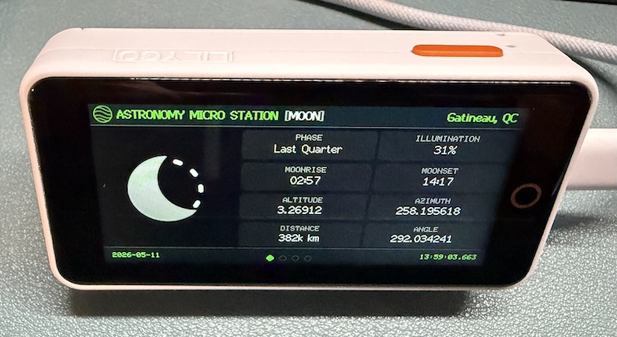
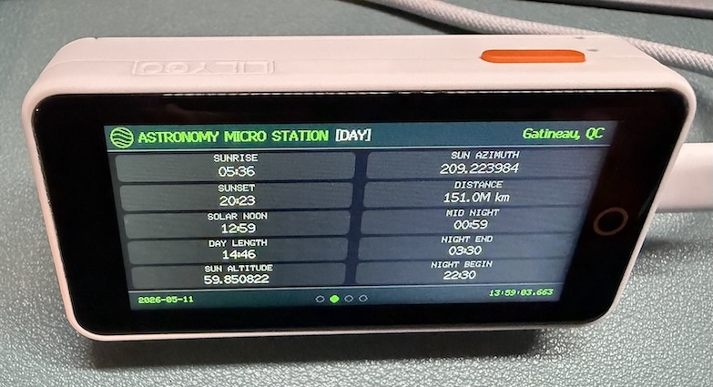
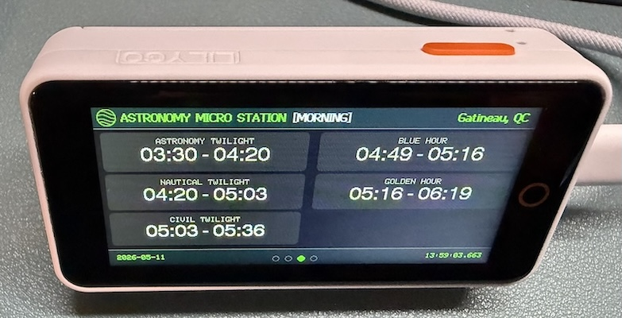
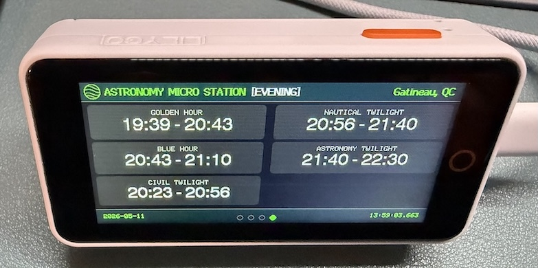

# Astronomy Micro Station for LILYGO T-Display S3 Pro

A standalone astronomy display for the LILYGO T-Display S3 Pro (ESP32-S3).  
Tracks the sun, moon, and light conditions — sunrise, sunset, golden hour, blue hour, twilight phases, moon phase and illumination — across four touch-navigated screens. Data fetched from ipgeolocation.io and cached locally for offline use.







---

## Screens

| # | Screen | Content |
| --- | ------ | ------- |
| 0 | **Moon Detail** | Phase image, illumination, rise/set, altitude, azimuth, distance |
| 1 | **Day / Sun** | Sunrise, sunset, solar noon, day length, altitude, azimuth, night begin/end |
| 2 | **Morning Twilight** | Astronomical, nautical, civil twilight · blue hour · golden hour (AM) |
| 3 | **Evening Twilight** | Golden hour · blue hour · civil, nautical, astronomical twilight (PM) |

All data is fetched from the [ipgeolocation.io Astronomy API](https://ipgeolocation.io/astronomy-api.html) every 15 minutes and cached to LittleFS for offline boot.

Every screen shares a common status bar at the bottom:

| Position | Content |
| -------- | ------- |
| Bottom left | Date of last API fetch (`2026-05-11`) |
| Bottom centre | Navigation dots (active screen highlighted) |
| Bottom right | Time of last API fetch (`08:34:11.738`) |

---

## Hardware

| Component | Detail |
| --------- | ------ |
| Board | [LilyGO T-Display S3 Pro](https://lilygo.cc/en-us/products/t-display-s3-pro?variant=43111690141877)|
| MCU | ESP32-S3R8, 240 MHz dual-core LX7 |
| Display | 2.33" IPS TFT, 480×222, ST7796, SPI |
| Touch | CST226SE capacitive (I2C) |
| Light / Proximity | LTR-553ALS-01 (I2C, shared bus) |
| Flash | 16 MB (6 MB app + 8 MB LittleFS) |
| PSRAM | 8 MB OPI (Octal) |
| Battery | Built-in 3.8 V 470 mAh + SY6970 PMIC |
| Connectivity | WiFi 802.11 b/g/n |

### GPIO Pin Map

| Function | Pin |
| -------- | --- |
| Display MOSI | 17 |
| Display SCLK | 18 |
| Display MISO | 8 |
| Display CS | 39 |
| Display DC | 9 |
| Display RST | 47 |
| Backlight PWM | 48 |
| I2C SDA (touch + sensor) | 5 |
| I2C SCL (touch + sensor) | 6 |
| Touch RST | 13 |
| Touch IRQ | 21 |
| Brightness UP button | 16 (active LOW) |
| Brightness DOWN button | 12 (active LOW) |

---

## Quick Start

### 1. Clone the repo

```bash
git clone https://github.com/stephanef/astro-micro-station.git
cd astro-micro-station
```

Open the folder in VSCode with the PlatformIO extension installed — dependencies are resolved automatically on first build.

### 2. Configure secrets

Copy `include/secrets_template.h` to `include/secrets.h` and fill in your credentials:

```cpp
// Required
#define WIFI_SSID       "your-network"
#define WIFI_PASSWORD   "your-password"
#define ASTRO_API_KEY   "your-key"        // free at ipgeolocation.io

// Required — your coordinates (can also be changed later from the web
// dashboard, at runtime, without reflashing — see "Adjusting for Your Location")
#define OBSERVER_LAT    43.7001f          // decimal degrees, positive = North
#define OBSERVER_LON    -79.4163f         // decimal degrees, negative = West

// Optional — only needed if MQTT_ENABLED is defined in config.h
#define MQTT_BROKER     "192.168.1.x"     // your Mosquitto broker IP
#define MQTT_USER       ""                // leave empty if broker has no auth
#define MQTT_PASS       ""
```

Get a free API key at [ipgeolocation.io/signup](https://app.ipgeolocation.io/signup).  
Free tier: 1000 req/day — at 15-minute refresh this app uses ~96 req/day.

To disable Home Assistant integration entirely, comment out `#define MQTT_ENABLED` in `config.h` — the MQTT credentials in `secrets.h` are then ignored.

`secrets.h` is gitignored and never committed. `config.h` (non-sensitive settings) is safe to commit as-is or copy from `config.example.h`.

### 3. Build and flash

```bash
pio run --target upload
pio device monitor        # 115200 baud
```

If the board does not auto-enter flash mode:

1. Hold **BOOT**
2. Press **RESET**
3. Release **BOOT**
4. Run `pio run --target upload`

### 4. First boot — LittleFS

On the very first boot the LittleFS partition is blank and will be formatted automatically. You will see `[LittleFS] OK` in the monitor. From that point the last successful API response is cached at `/astro_cache.json` and loaded on any boot where WiFi is unavailable. If you've ever saved a location from the [web dashboard](#web-dashboard), that override is separately persisted at `/location.json` and takes priority over the `secrets.h` default on every boot.

---

## Navigation

| Input | Action |
| ----- | ------ |
| **Tap** anywhere | Next screen (cycles 0 → 1 → 2 → 3 → 0) |
| **Long press** (> 0.8 s) | Toggle red night-vision mode |
| **Wave hand** at top sensor | Wake display from dim |
| **Brightness UP** button (IO16) | Increase backlight, hold to repeat |
| **Brightness DOWN** button (IO12) | Decrease backlight, hold to repeat |

Backlight dims automatically after `DIM_TIMEOUT_SEC` seconds of inactivity (default 30 s). Brightness level is preserved across dim/wake cycles.

---

## Night-Vision (Red Mode)

Long-press anywhere to toggle. In red mode:

- Background, cards, and text shift to deep red tones
- Moon phase image is re-rendered as red-luminance (shading preserved)
- Backlight target drops to `BACKLIGHT_RED_MODE` (default 60/255)

---

## Web Dashboard

A companion webpage served directly by the device over WiFi — same astronomy data as the on-device screens, laid out for a desktop or phone browser instead of a 480×222 panel. Purely additive: the on-device touch UI and screens are completely unaffected by this feature.

### Accessing it

Once WiFi connects, the serial monitor prints the URL:

```text
[WebDashboard] http://192.168.1.xx/
```

Open that address in any browser on the same network. Port is configurable via `WEB_DASHBOARD_PORT` in `config.h` (default `80`).

### What it shows

- Moon phase, illumination, sun altitude, day length, sunset — at a glance
- A sky-position widget (live azimuth/altitude for sun and moon)
- A light-curve timeline — night → astronomical → nautical → civil → daylight — with sunrise/solar-noon/sunset markers
- Full sun and moon detail panels, plus morning/evening twilight breakdowns
- A night-vision toggle mirroring the device's own red mode (page-local only — doesn't touch the physical device)

The page polls `/api/astro` at the same interval the device re-fetches from ipgeolocation.io (`API_REFRESH_INTERVAL_MS`, default 15 min) — the response tells the page how often to poll, so there's one source of truth instead of a hardcoded duplicate.

### Changing your location from the dashboard

The **Observer location** card pushes a new latitude/longitude to the device — no reflash needed:

- Enter coordinates and click **Save & refresh** — persists to `/location.json` on LittleFS (survives reboots) and triggers an immediate re-fetch for the new location
- Click **Use home location** to reset to the coordinates compiled into `secrets.h` (`OBSERVER_LAT`/`OBSERVER_LON`) without retyping them
- The city/province label shown top-right — on both the dashboard and the device's own header — is **not typed in anywhere**. It's resolved automatically from ipgeolocation.io's reverse-geocoded response on every fetch, so it updates itself when you travel

### Remote access

The dashboard is only reachable on your local network by default. For remote access (e.g. over [Tailscale](https://tailscale.com/)), run a small reverse proxy on any always-on machine that already has network access to the device — a lightweight `socat` container forwarding a Tailscale-reachable port to the device's local IP works well and needs no changes to this firmware.

---

## Home Assistant Integration (optional)

Enable by defining `MQTT_ENABLED` in `config.h` (already set by default).  
Set `MQTT_TOPIC_STATUS` to your preferred base topic (default: `astronomy`).

### Auto-discovery — no YAML required

The device uses **MQTT Discovery**. On every MQTT connection it publishes 19 sensor config messages to `homeassistant/sensor/astro_<name>/config`. Home Assistant picks these up automatically and creates a single **Astro Micro Station** device with all sensors grouped under it — no `configuration.yaml` editing needed, exactly like other auto-discovered devices.

Sensors registered automatically:

| Sensor | Source topic |
| ------ | ------------ |
| Moon Phase, Moon Illumination, Moonrise, Moonset, Moon Altitude, Moon Azimuth, Moon Distance | `astronomy/moon` |
| Sunrise, Sunset, Solar Noon, Day Length, Sun Altitude, Sun Azimuth | `astronomy/sun` |
| Golden Hour AM, Blue Hour AM, Civil Twilight AM | `astronomy/morning` |
| Golden Hour PM, Blue Hour PM, Civil Twilight PM | `astronomy/evening` |

### MQTT topics

After every successful API fetch (every 15 minutes) the device publishes 4 **retained** JSON topics:

| Topic | Content |
| ----- | ------- |
| `astronomy` | `online` / `offline` (LWT — broker publishes `offline` automatically if device disconnects) |
| `astronomy/sun` | date, time, sunrise, sunset, solar noon, day length, altitude, azimuth, distance, night begin/end, midnight |
| `astronomy/moon` | phase, phase name, illumination %, rise, set, altitude, azimuth, angle, distance |
| `astronomy/morning` | astronomical, nautical, civil twilight · blue hour · golden hour times |
| `astronomy/evening` | golden hour · blue hour · civil, nautical, astronomical twilight times |

### Troubleshooting — device not appearing in Home Assistant

1. Go to **Settings → Devices & Services → MQTT → Configure**, subscribe to `homeassistant/sensor/astro_sunrise/config` and click **START LISTENING**. You should see a JSON config payload immediately (it is retained).
2. If nothing appears, check the serial monitor for `[MQTT] Discovery:` lines at boot.
3. If discovery messages are present but no device appears in HA, restart the HA MQTT integration: **Settings → Devices & Services → MQTT → Reload**.
4. Verify broker IP and credentials match `MQTT_BROKER` / `MQTT_USER` in `config.h`.

To disable MQTT entirely, comment out `#define MQTT_ENABLED` in `config.h`.

---

## Serial Monitor Output

Key log prefixes for diagnostics:

| Prefix | Meaning |
| ------ | ------- |
| `[Boot]` | Startup sequence |
| `[WiFi]` | Connection status and RSSI |
| `[NTP]` | Time sync |
| `[LittleFS]` | Filesystem mount result |
| `[AstroAPI]` | HTTP fetch, parse result, cache save/load |
| `[fetchAstro]` | Heap + PSRAM snapshot after each fetch |
| `[Display]` | Init, sprite buffer, heap + PSRAM at boot |
| `[Mem]` | Hourly heap + PSRAM trend (watch `min` for leaks) |
| `[Nav]` | Screen change events |
| `[MQTT] →` | Data topic published (sun / moon / morning / evening) |
| `[MQTT] Discovery:` | Auto-discovery config published for one sensor |
| `[WebDashboard]` | Dashboard server start URL, and location updates saved from it |

Example memory line:

```text
[Mem]  heap=186432  min=164208  maxBlock=163840  psram=7823104
```

The `min` value is the all-time low — a steadily decreasing `min` indicates a heap leak.

---

## API Data — Refresh Behaviour

All fields are fetched from the API and replaced on **every 15-minute refresh** — nothing is cached selectively. The distinction below is purely about how fast the API values move, not about how often the device fetches them.

### Stable throughout the day (API returns the same value all 24 h)

| Field | Notes |
| ----- | ----- |
| Sunrise / Sunset | Set once at midnight for the date |
| Solar noon | Set once for the date |
| Day length | Set once for the date |
| Night begin / end | Set once for the date |
| Astronomical / Nautical / Civil twilight | All begin/end times set for the date |
| Blue hour begin / end (AM & PM) | Set for the date |
| Golden hour begin / end (AM & PM) | Set for the date |
| Moonrise / Moonset | Set for the date |
| Moon phase | Changes once every ~3.7 days |
| Moon illumination | Changes by < 1 % per hour |

### Continuously changing (visibly different each 15-minute fetch)

| Field | Rate of change |
| ----- | -------------- |
| Sun altitude | ~15° per hour near transit |
| Sun azimuth | ~15° per hour |
| Moon altitude | ~0.5° per hour |
| Moon azimuth | ~0.5° per hour |
| Moon distance | Tens of km per hour (perigee/apogee drift) |
| Fetch date / time (`fetchDate` / `currentTime`) | Timestamp of the API call — updates every fetch |

---

## Adjusting for Your Location

Two ways to set the observer coordinates used for every astronomy calculation:

### At runtime — via the web dashboard (no reflash)

Open the [web dashboard](#web-dashboard) and use the **Observer location** card. Changes persist to LittleFS and take effect immediately — no rebuild, no re-upload, no touching the device. Click **Use home location** any time to jump back to your `secrets.h` default.

### At build time — via `secrets.h`

The compiled-in default (used on first boot, and whenever no dashboard override has been saved):

```cpp
#define OBSERVER_LAT    43.7001f          // decimal degrees, positive = North
#define OBSERVER_LON    -79.4163f         // decimal degrees, negative = West
```

Timezone is resolved automatically, server-side, by ipgeolocation.io from these coordinates — there's no timezone or UTC-offset setting to configure.

---

## File Structure

```text
astro-micro-station/
├── platformio.ini              # Build config, libraries, pin definitions
├── partitions_custom.csv       # 6 MB app / 8 MB LittleFS
├── include/
│   ├── secrets.h               # ⚠ gitignored — WiFi, API key, MQTT creds, coordinates
│   ├── secrets_template.h      # Safe template — copy to secrets.h and fill in
│   ├── config.h                # Non-sensitive settings (safe to commit)
│   ├── config.example.h        # Template for config.h
│   ├── AstroAPI.h              # ipgeolocation.io data structures + class
│   ├── DisplayManager.h        # Colour palette, screen class declaration
│   ├── MQTTManager.h           # HA status publisher (stub when disabled)
│   ├── WebDashboard.h          # Web dashboard server declarations
│   ├── dashboard_html.h        # Dashboard page (HTML/CSS/JS) as a PROGMEM string
│   ├── icons.h                 # ICON_ASTRO — 22×22 RGB565 PROGMEM
│   └── moon_icons.h            # 8 moon phase images — 155×155 RGB565 PROGMEM
├── src/
│   ├── main.cpp                # Setup, loop, WiFi, NTP, touch FSM, brightness
│   ├── AstroAPI.cpp            # HTTP fetch, JSON parse, LittleFS cache, location
│   ├── DisplayManager.cpp      # All screen rendering
│   ├── MQTTManager.cpp         # MQTT connection + discovery + data publish
│   └── WebDashboard.cpp        # ESPAsyncWebServer routes: dashboard + JSON API
└── assets/
    ├── moon-phases/            # Source SVGs for moon phase images (8 files)
    ├── icons/                  # Source PNG for header icon
    └── tools/
        └── svg_to_h.py         # Converts SVGs → moon_icons.h (run in venv)
```

---

## Regenerating Moon Phase Images

The moon phase header file is generated from SVG sources using a Python script:

```bash
cd assets/tools
python3 -m venv venv && source venv/bin/activate
pip install cairosvg pillow
python3 svg_to_h.py
# output written to include/moon_icons.h
```

Source files are in `assets/moon-phases/`. The script renders each SVG to 155×155 greyscale RGB565, alpha-composited on black, with `0xFFFF` as the chroma key for transparency.

---

## License

This project is licensed under the MIT License - see the [LICENSE](LICENSE) file for details.

## Support

- **Issues**: [GitHub Issues](https://github.com/sfrechette/astro-micro-station/issues)
